# Modelado de Software UCM FDI
# Royal Market Cod ⚜️

## Contenido
- [Estructura Base de Datos - DAO](#estructura-de-base-de-datos-dao)
- [Guia Instalacion Base de Datos DAO con XAMPP](#guia-instalacion-base-de-datos-dao-xampp)
- [Estructura Base de Datos - JPA](#estructura-de-base-de-datos-jpa)
- [Guia Instalacion Base de Datos JPA con XAMPP](#guia-instalacion-base-de-datos-jpa-xampp)
- [Guia Sobre Proiedad Schema Generation en Persistance.xml](#guia-sobre-propiedad-schema-generation-en-persistancexml-)

### Estructura de Base De Datos DAO
[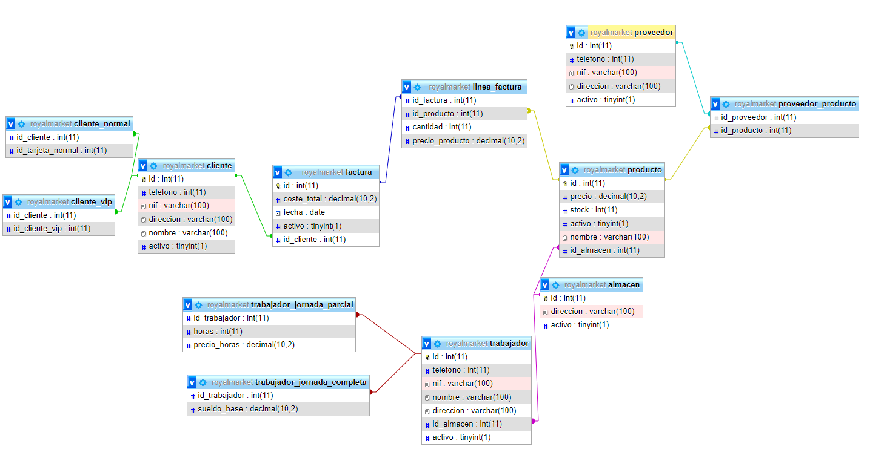](https://github.com/anavarro-fdi-ucm-es/ms2324royalmarketcod/blob/master/RoyalMarketCod/resources/docs/designer_database.png)

### Guia Instalacion Base de Datos DAO XAMPP
  

1. Instalamos previamente el XAMPP, activamos tanto el Module *Apache* y *MySql*. Pulsamos en Admin para abrir la interfaz de PhPMyAdmin.
[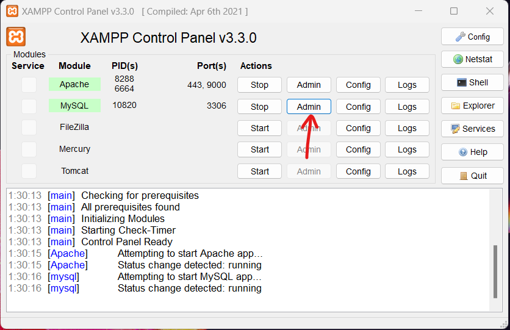](https://github.com/anavarro-fdi-ucm-es/ms2324royalmarketcod/blob/master/RoyalMarketCod/resources/docs/install_bbdd/PasoCero.png)

2. Pulsamos en el apartado ***Importar***
[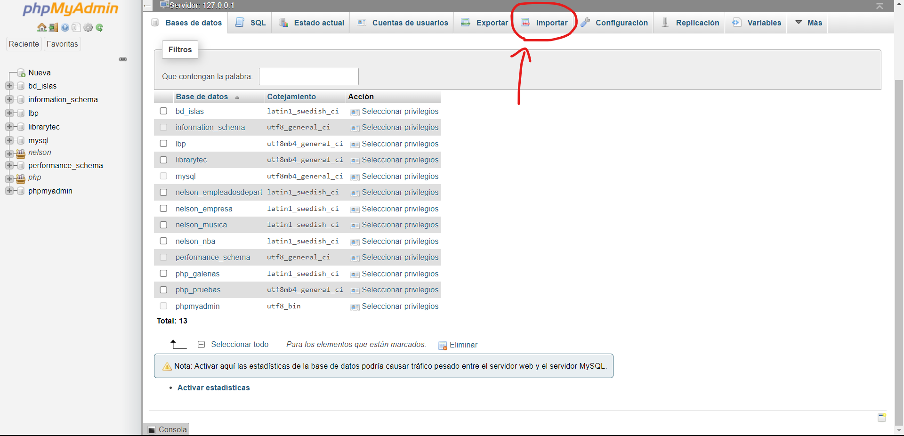](https://github.com/anavarro-fdi-ucm-es/ms2324royalmarketcod/blob/master/RoyalMarketCod/resources/docs/install_bbdd/PasoUno.png)

3. Pulsamos en ***Seleccionar archivo*** para importar nuestro archivo SQL.
[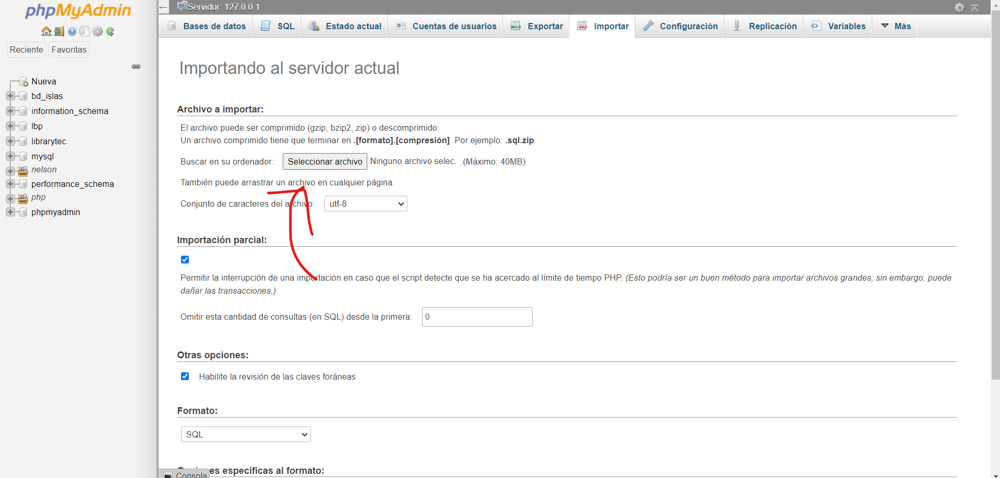](https://github.com/anavarro-fdi-ucm-es/ms2324royalmarketcod/blob/master/RoyalMarketCod/resources/docs/install_bbdd/PasoDos.png)

4. Buscamos nuestro archivo SQL. Para buscar nuestro archivo: 
Click derecho en la carpeta *sql* > Show in > System Explorer 
[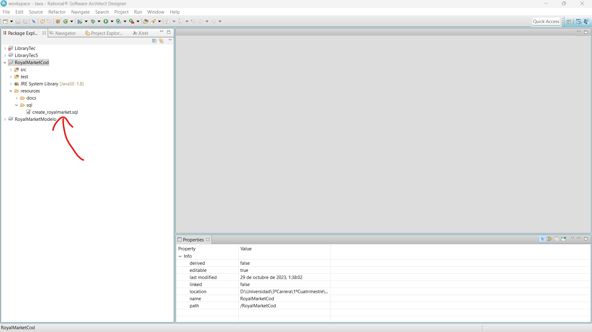](https://github.com/anavarro-fdi-ucm-es/ms2324royalmarketcod/blob/master/RoyalMarketCod/resources/docs/install_bbdd/PasoTres.png)
[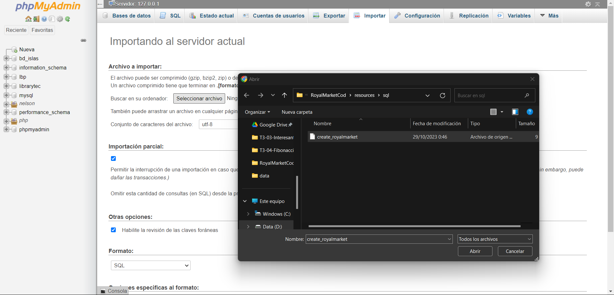](https://github.com/anavarro-fdi-ucm-es/ms2324royalmarketcod/blob/master/RoyalMarketCod/resources/docs/install_bbdd/PasoCuatro.png)

5. Una vez seleccionado aparecera nuestro archivo seleccionado. Pulsamos en el botono ***Continuar***
[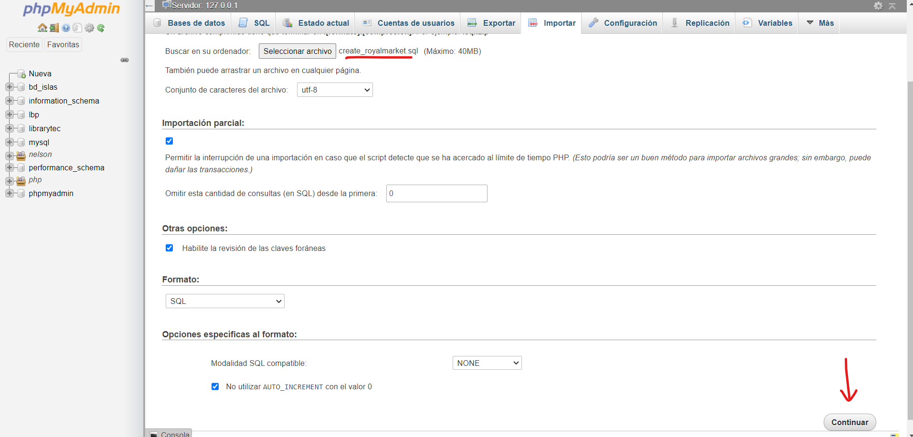](https://github.com/anavarro-fdi-ucm-es/ms2324royalmarketcod/blob/master/RoyalMarketCod/resources/docs/install_bbdd/PasoCinco.png)

6. Si todo es correcto aparecera *Importacion Ejecutada exitosamente* y aparecera la BBDD en nuestro indice.
[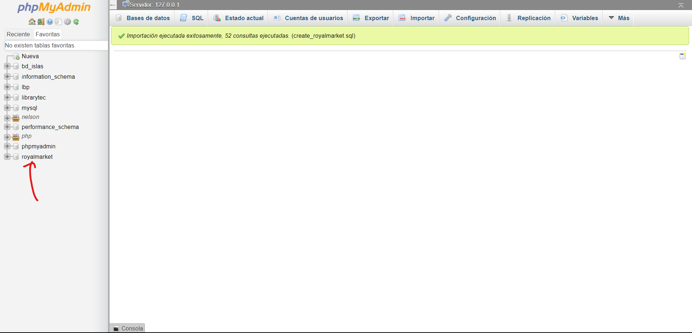](https://github.com/anavarro-fdi-ucm-es/ms2324royalmarketcod/blob/master/RoyalMarketCod/resources/docs/install_bbdd/PasoSeis.png)
[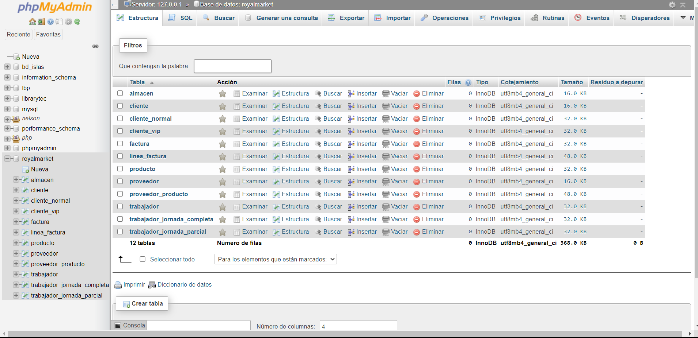](https://github.com/anavarro-fdi-ucm-es/ms2324royalmarketcod/blob/master/RoyalMarketCod/resources/docs/install_bbdd/PasoSiete.png)

### Estructura de Base De Datos JPA
[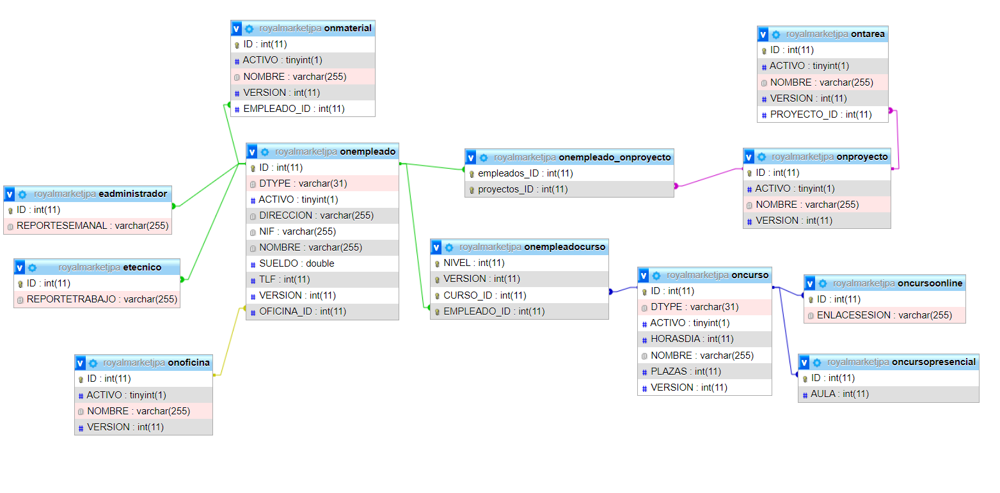](https://github.com/anavarro-fdi-ucm-es/ms2324royalmarketcod/blob/master/RoyalMarketCod/resources/docs/designer_database_jpa.png)

### Guia Instalacion Base de Datos JPA XAMPP

1. Instalamos previamente el XAMPP, activamos tanto el Module *Apache* y *MySql*. Pulsamos en Admin para abrir la interfaz de PhPMyAdmin.

2. Pulsamos en el apartado ***Nueva*** para crear la BBDD.

3. Le asignamos el nombre de *royalmarketjpa* y pulsamos el boton de ***crear***.
[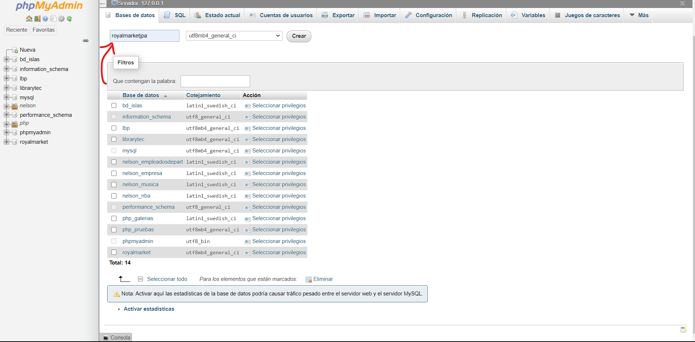](https://github.com/anavarro-fdi-ucm-es/ms2324royalmarketcod/blob/master/RoyalMarketCod/resources/docs/install_bbdd_jpa/PasoUno.png)

4. En nuestro fichero *persistance.xml*, en la propiedad *javax.persistence.schema-generation.database.action* le asignamos *create*, esta propiedad nos genera las tablas y campos de la BBDD, es recomendable que despues de esto le asignemos *none* para que solo actualize los datos de la BBDD y no cree las tablas nuevamente. 
[Para saber mas propiedades](#guia-sobre-propiedad-schema-generation-en-persistancexml-)
[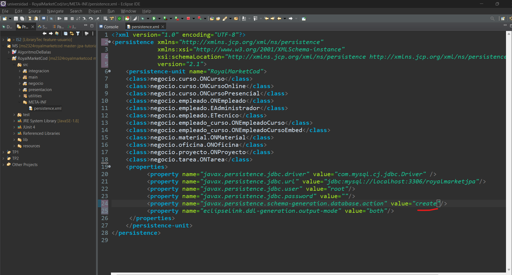](https://github.com/anavarro-fdi-ucm-es/ms2324royalmarketcod/blob/master/RoyalMarketCod/resources/docs/install_bbdd_jpa/PasoDos.png)

5. Corremos el programa y en la consola SOLO aparecera un mensaje de EclipseLink *"ServerSession(1603177117)--EclipseLink, version: Eclipse Persistence Services - 2.7.7.v20200504-69f2c2b80d"*, esto significa que se ha creado correctamente.
[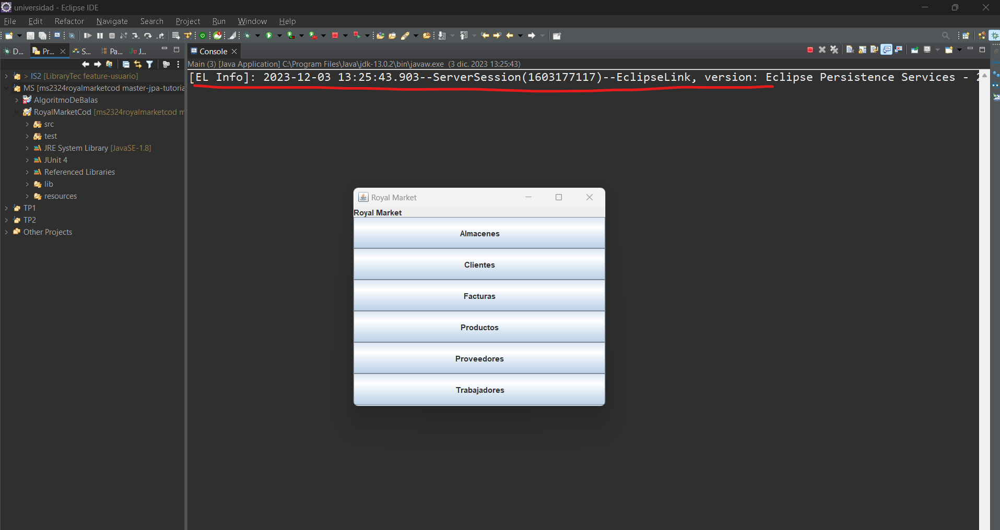](https://github.com/anavarro-fdi-ucm-es/ms2324royalmarketcod/blob/master/RoyalMarketCod/resources/docs/install_bbdd_jpa/PasoTres.png)

⚠️RECORDATORIO⚠️: Esto se ejecutara solo cuando se cree el EntityManagerFactory.
[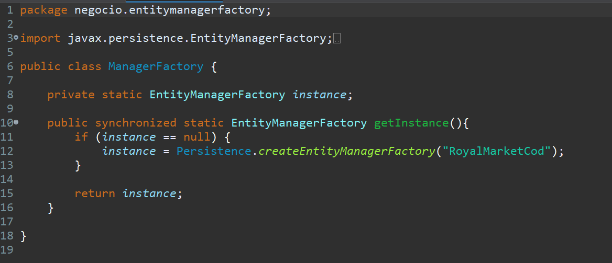](https://github.com/anavarro-fdi-ucm-es/ms2324royalmarketcod/blob/master/RoyalMarketCod/resources/docs/install_bbdd_jpa/PasoCuatro.png)

### Guia Sobre Propiedad schema-generation en Persistance.xml 🕮
- ***create***: Crea el esquema de la BBDD, si las tablas existen puede eliminar las tablas existentes y la creacion de nuevas tablas.
- ***drop***: Borra el esquema de la BBDD.
- ***drop-and-create***: Borra el esquema de la BBDD y la crea nuevamente.
- ***create-or-extend-tables***: Crea o amplia tablas en la BBDD.
- ***none***: No crea ni borra ninguna esquema de la BBDD, solo se utilizara para actualizar datos del esquema actual.
